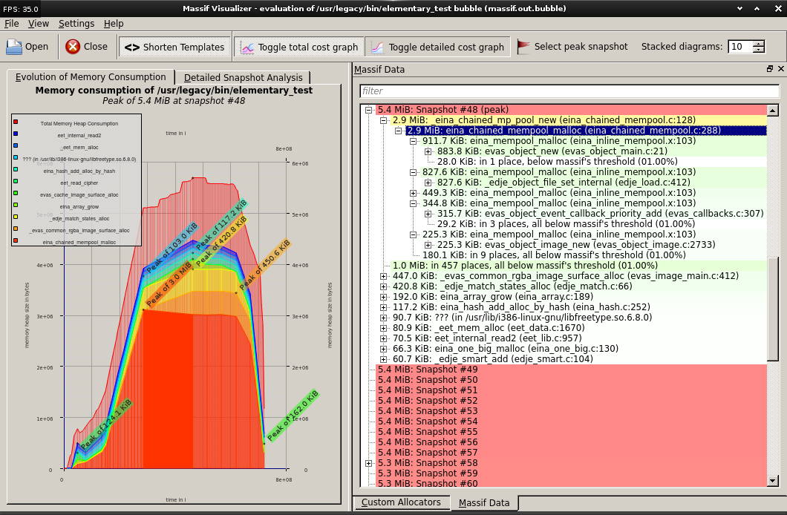

Find memory leaks for ROOT object: TObjectTable
-----------------------------------------------

ROOT has a special class, called `TObjectTable`, which optionally keeps track
of all `new` and `delete` operations invoked on a ROOT object, or, in other
words, any object that inherits from `TObject`.

Hooks are present in the `TObject` constructor and destructor to increment and
decrement a counter for the specific object you are creating or destroying.
This operation is computationally expensive, so you have to manually turn it on
**before starting ROOT**.

You can create a `.rootrc` file in the current directory, or edit the
`$ROOTSYS/etc/system.rootrc` file, and enable the memory and object tracking
like this:

```
Root.MemStat: 1
Root.ObjectStat: 1
```

Inside ROOT, you can then tell the program at any point to print the current
number of objects by using the `gObjectTable` singleton:

```
$> gObjectTable->Print()
class                     cnt    on heap     size    total size    heap size

TKey                        4          4       72           288          288
TClass                     84         84       80          6720         6720
TDataMember               276        276       24          6624         6624
TObject                    11         11       12           132          132
TMethod                  1974       1974       64        126336       126336
TDataType                  34         34       56          1904         1904
TList                    2328       2328       36         83808        83808
TH1F                        1          1      448           448          448
TText                    2688       2688       56        150528       150528
TGaxis                      1          0      120           120            0
```

The **cnt** column is very useful as it gives you the number of instances of a
certain class: if you, for instance, forgot to delete an object, you would see
that number constantly increasing and you would notice it quite easily.

> Remember to **turn MemStat and ObjectStat off** when done! They are very
> heavy for production operations.


Valgrind
--------

[Valgrind](http://valgrind.org/) is a complex and robust tool to perform code
analysis and profiling.

Valgrind is composed of many *tools*, each one of them performing a different
task. The two tools we are interested in are:

* **memcheck**: the memory checker
* **callgrind**: a performance profiler

Installing Valgrind on Ubuntu is easy:

```bash
apt install valgrind
```

On OS X it is easy as well. With Homebrew:

```bash
brew install valgrind
```

### Memory check

Memory checks with Valgrind are useful to find the following memory
problems:

* invalid memory reads
* invalid memory writes
* potential memory leaks

Valgrind will indicate the potential problems in the logfile it
produces. Since it can be hard to understand the logfile, there are
also graphical tools showing:

* memory trends (with respect to running time): useful to see when and
  how the memory grows
* allocation peaks: useful to see which are the parts of your code
  making the most memory allocations

We recommend using the massif-visualizer tool. On Ubuntu 14.04, it can be
installed by
[getting it from the Kubuntu repositories](http://askubuntu.com/questions/522263/installing-massif-visualizer-on-ubuntu-14-04):

```
sudo add-apt-repository ppa:kubuntu-ppa/backports
sudo apt-get update
sudo apt-get install massif-visualizer
```

Run your program under Valgrind's memory check. The following command
is suitable for AliRoot (see `man valgrind` for more details):

```bash
valgrind \
  --tool=memcheck \
  --error-limit=no \
  --max-stackframe=3060888 \
  --suppressions=$ROOTSYS/etc/valgrind-root.supp \
  --leak-check=no \
  --num-callers=40 \
  --log-file=/tmp/valgrind_memory.log \
  root -b -q launchMyAnalysis.C+
```

A couple of notes.

* The `--suppressions` switch is used to tell Valgrind which alleged
  memory problems to ignore. The file we pass to it is the ROOT
  suppressions file, and greatly simplifies the produced output by
  reducing false positives.
* The `--leak-check=no` makes the execution much faster, but it does
  not check for memory leaks. Use `--leak-check=full` for a deeper
  inspection, but expect a longer running time.

> Valgrind traps all memory operations through an internal "virtual
> machine": this is why it can be up to 40 times slow. Run your
> program under Valgrind on a very small dataset!

To produce data readable with the massif-visualizer, use
`--tool=massif`, which invokes the
[massif heap analyzer](http://valgrind.org/docs/manual/ms-manual.html)
instead of memcheck.

An example of the interactive output produced by massif-visualizer is
presented:




### Performance profiler

Valgrind has a performance profiler called
[callgrind](http://valgrind.org/docs/manual/cl-manual.html). Its
purpose is to analyze how much time is spent in each
function. As we have already discussed, being a deterministic tool
every single function of your program is trapped and captured, which
makes the tool very precise, but also very slow.

Callgrind's output can be analyzed by means of the KCachegrind program
that can be installed on Ubuntu 14.04 with:

```bash
sudo apt install kcachegrind
```

The typical way of invoking Valgrind's callgrind for Root programs is:

```bash
valgrind
  --tool=callgrind \
  --log-file=/tmp/valgrind_callgrind.log \
  root -b -q launchMyAnalysis.C+
```

The produced output can be browsed interactively by means of KCachegrind. An
output similar to the following is presented:


where colored blocks indentify graphically which are the functions where your
program spends most of its time.
